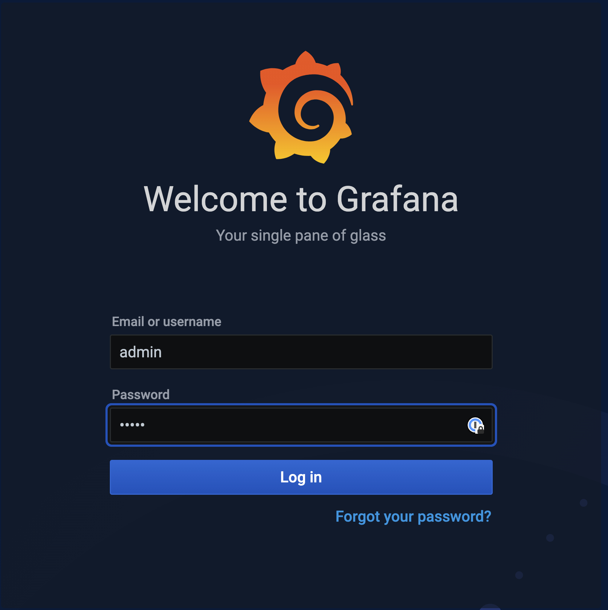
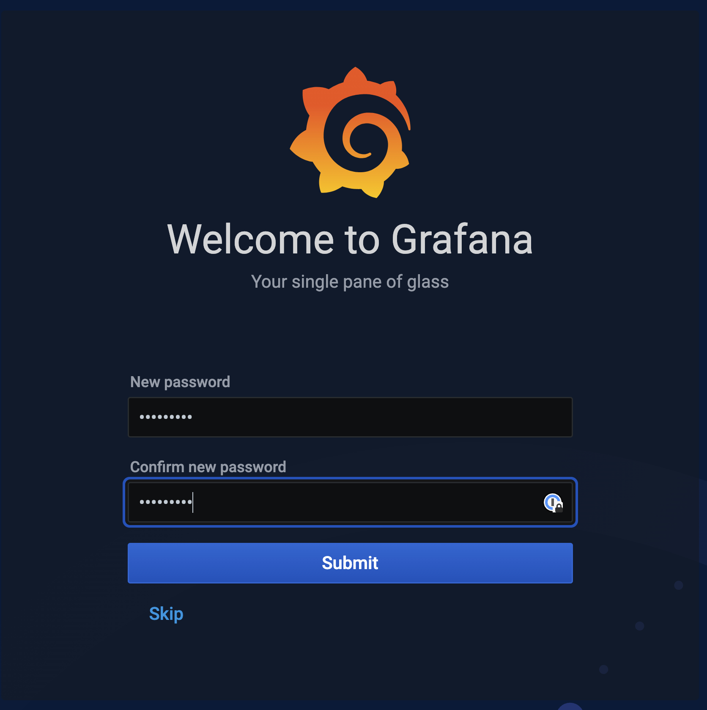
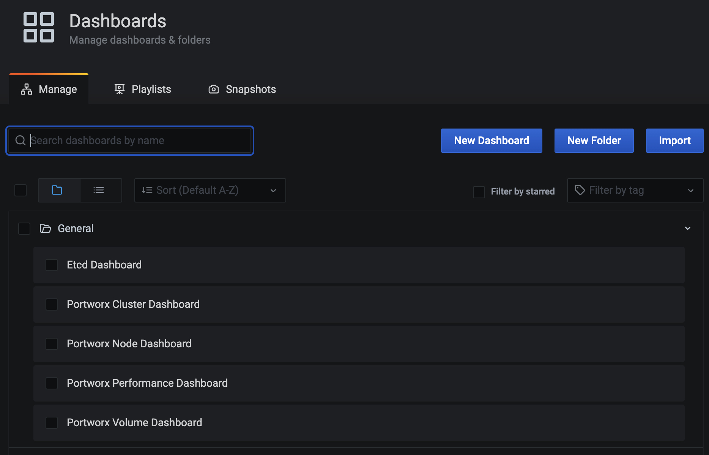
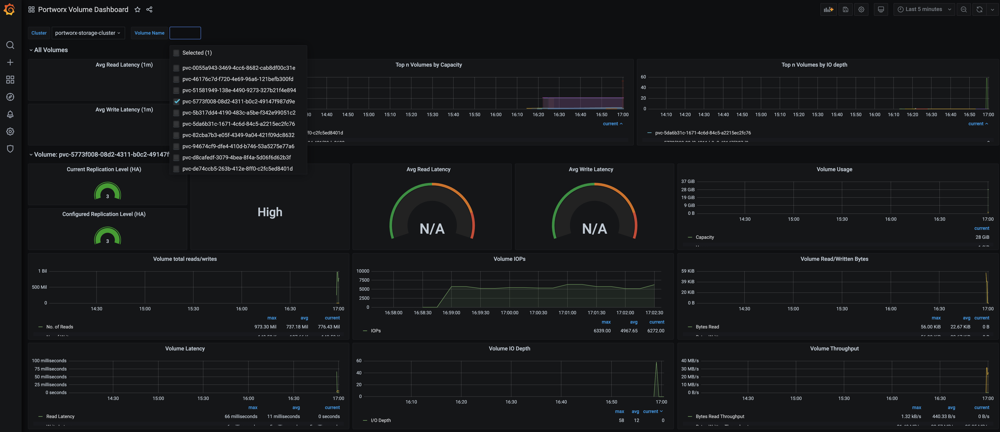
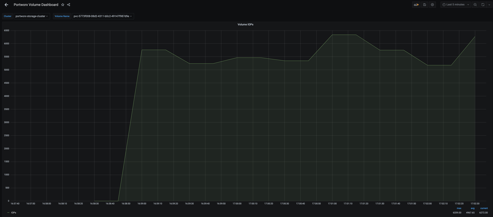
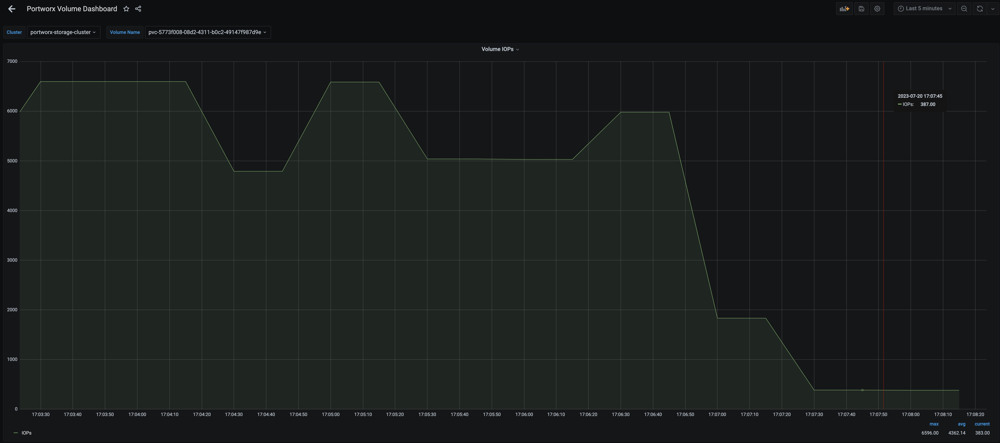

===================================
No More Noisy Neighbors on OpenShift using Portworx Application IO Control
===================================

Using Application IO Control
-------------------------

In this module, we will use Portworx Application I/O control to dynamically update Read and Write IOPS limits to avoid noisy neighbor scenarios where applications sharing a Kubernetes cluster starve for storage resources. Keep in mind you can also limit bandwidth to a persistent volume using Application I/O Control with Portworx, not just IOPS!

Configuring Grafana Dashboards for Portworx 
~~~~~~~~~~

Enter the following commands to download the Grafana dashboard and datasource configuration files:

.. code-block:: shell

  curl -O https://docs.portworx.com/samples/k8s/pxc/grafana-dashboard-config.yaml
  sleep 3
  curl -O https://docs.portworx.com/samples/k8s/pxc/grafana-datasource.yaml

Create a configmap for the dashboard and data source:

.. code-block:: shell
  
  oc -n portworx create configmap grafana-dashboard-config --from-file=grafana-dashboard-config.yaml
  oc -n portworx create configmap grafana-source-config --from-file=grafana-datasource.yaml
  
Download and install Grafana dashboards using the following commands:

.. code-block:: shell

  curl "https://docs.portworx.com/samples/k8s/pxc/portworx-cluster-dashboard.json" -o portworx-cluster-dashboard.json && \
  curl "https://docs.portworx.com/samples/k8s/pxc/portworx-node-dashboard.json" -o portworx-node-dashboard.json && \
  curl "https://docs.portworx.com/samples/k8s/pxc/portworx-volume-dashboard.json" -o portworx-volume-dashboard.json && \
  curl "https://docs.portworx.com/samples/k8s/pxc/portworx-performance-dashboard.json" -o portworx-performance-dashboard.json && \
  curl "https://docs.portworx.com/samples/k8s/pxc/portworx-etcd-dashboard.json" -o portworx-etcd-dashboard.json

.. code-block:: shell

  oc -n portworx create configmap grafana-dashboards \
  --from-file=portworx-cluster-dashboard.json \
  --from-file=portworx-performance-dashboard.json \
  --from-file=portworx-node-dashboard.json \
  --from-file=portworx-volume-dashboard.json \
  --from-file=portworx-etcd-dashboard.json 

Create the grafana yaml file using the following command: 

.. code-block:: shell

  cat << EOF > /tmp/grafana.yaml
  apiVersion: apps/v1
  kind: Deployment
  metadata:
    name: grafana
    namespace: portworx
    labels:
      app: grafana
  spec:
    replicas: 1
    selector:
      matchLabels:
        app: grafana
    template:
      metadata:
        labels:
          app: grafana
      spec:
        containers:
          - image: grafana/grafana:7.3.0
            name: grafana
            imagePullPolicy: IfNotPresent
            resources:
              limits:
                cpu: 100m
                memory: 100Mi
              requests:
                cpu: 100m
                memory: 100Mi
            readinessProbe:
              httpGet:
                path: /login
                port: 3000
            volumeMounts:
              - name: grafana-dash-config
                mountPath: /etc/grafana/provisioning/dashboards
              - name: dashboard-templates
                mountPath: /var/lib/grafana/dashboards
              - name: grafana-source-config
                mountPath: /etc/grafana/provisioning/datasources
        volumes:
          - name: grafana-source-config
            configMap:
              name: grafana-source-config
          - name: grafana-dash-config
            configMap:
              name: grafana-dashboard-config
          - name: dashboard-templates
            configMap:
              name: grafana-dashboards
  ---
  apiVersion: v1
  kind: Service
  metadata:
    name: grafana-svc
    namespace: portworx
    labels:
      app: grafana
  spec:
    type: LoadBalancer
    selector:
      app: grafana
    ports:
    - protocol: TCP
      port: 3000
      targetPort: 3000
      name: grafana
  EOF

.. code-block:: shell

  oc apply -f /tmp/grafana.yaml

Wait till Grafana is up and running 

.. code-block:: shell
  
  watch oc get pods -n portworx -l app=grafana 
  
Use ctrl+c to exit out of the watch command. 

Downloading Kubestr and creating FIO profiles
~~~~~~~~~~

.. code-block:: shell

  wget https://github.com/kastenhq/kubestr/releases/download/v0.4.36/kubestr_0.4.36_Linux_amd64.tar.gz
  sleep 5
  tar -xvf kubestr_0.4.36_Linux_amd64.tar.gz 

.. code-block:: shell

  cat << EOF > /tmp/rand-write.fio
  ##Random Write 4k blocksize test
  [global]
  ioengine=libaio
  size=20GiB
  name=fio-rand-write
  direct=1
  iodepth=128
  numjobs=1
  group_reporting=1
  ##----layout file-------
  [4k-init-write]
  blocksize=4k
  filename=/dataset/fio.dat
  readwrite=randwrite
  end_fsync=1
  ##----Begin 4k tests-------
  [4k-rand-write]
  stonewall
  blocksize=4k
  filename=/dataset/fio.dat
  readwrite=randwrite
  end_fsync=1
  EOF

Generating I/O using Kubestr
~~~~~~~~~~

Let's generate some I/O which is unconstrained against a persistent volume:

.. code-block:: shell

  ./kubestr fio -z 30G -s block-sc -f /tmp/rand-write.fio -o json -e /tmp/rand-RW-WL.json >& /dev/null &

Inspect PVC
~~~~~~~~~~
Note the last few digits of the PVC ID that was created, you'll need it in the next step:

.. code-block:: shell

  oc get pvc 

Portworx Volume Dashboard using Grafana
~~~~~~~~~~

Use the following command to access the LoadBalancer endpoint for the Grafana instance we deployed earlier.

.. code-block:: shell

  oc get svc -n portworx grafana-svc

Navigate to the LoadBalancer endpoint and append :3000 at the end. Log in using admin/admin credentials. You will be prompted to set a new password for Grafana. You can set it to Password!. If you use anything else as a password, please remember it - or you may not be able to access Grafana in upcoming modules if desired!

Once logged in, find the Portworx Volume Dashboard by navigating to left pane --> Dashboards --> Manage --> Portworx Volume Dashboard

On the Volume Dashboard, find your persistent volume using the PVC ID from Task 2 in the Volume Name drop down.

After you have selected the right volume, find the Volume IOPS pane, click View from the dropdown, and then change the timeline view to last 5 mins (defaults to last 3 hours) using the drop down box in the upper right corner of Grafana.

You should see the current IOPS load on the volume is more than 5000.

Update the IOPS limits for the PVC
~~~~~~~~~~

Let's get our volume ID:

.. code-block:: shell
  
  PX_POD=$(oc get pods -l name=portworx -n portworx -o jsonpath='{.items[0].metadata.name}')
  VolName=$(oc exec -it $PX_POD -n portworx -- /opt/pwx/bin/pxctl volume list | grep "28 GiB" | awk '{print $2}' )
  
Then inspect the volume using the command:

.. code-block:: shell

  oc exec -it $PX_POD -n portworx -- /opt/pwx/bin/pxctl volume inspect ${VolName}
  
Next, let's update the MAX Read and Write IOPS for the volume to 750 IOPS:

.. code-block:: shell

  oc exec -it $PX_POD -n portworx -- /opt/pwx/bin/pxctl volume update --max_iops 750,750 ${VolName}
  
After updating the volume, we can observe the new IOPS settings via pxctl:

.. code-block:: shell

  oc exec -it $PX_POD -n portworx -- /opt/pwx/bin/pxctl volume inspect ${VolName}

Monitor the updated IOPS numbers using Portworx Volume Dashboard
~~~~~~~~~~
Navigate back to the Grafana UI and find the Volume IOPS pane for our volume again. You should see the current IOPS number is now set to below 750.

Note: Grafana takes a couple of minute to reflect the changes, so if you dont see the drop in IOPS right away, wait a couple of minutes and refresh the page again.

That's how you can use Portworx Application IO control to ensure a single application doesn't consume all the resources available to the cluster and cause a noisy neighbor issue!

Wrap up this module
-------------------------
Use the following commands to delete objects used for this specific scenario:

.. code-block:: shell

  kubectl delete pods --all
  kubectl delete pvc --all
  kubectl wait --for=delete pvc/all --timeout=60s
  rm grafana-dashboard-config.yaml
  rm grafana-datasource.yaml
  rm portworx-cluster-dashboard.json
  rm portworx-node-dashboard.json
  rm portworx-volume-dashboard.json
  rm portworx-performance-dashboard.json
  rm portworx-etcd-dashboard.json
  rm /tmp/grafana.yaml
