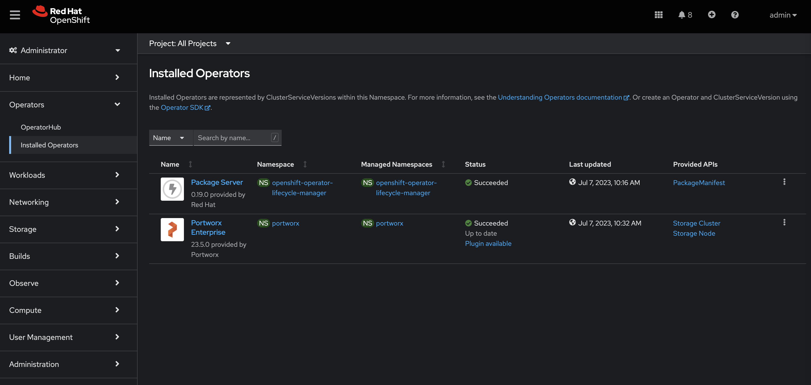
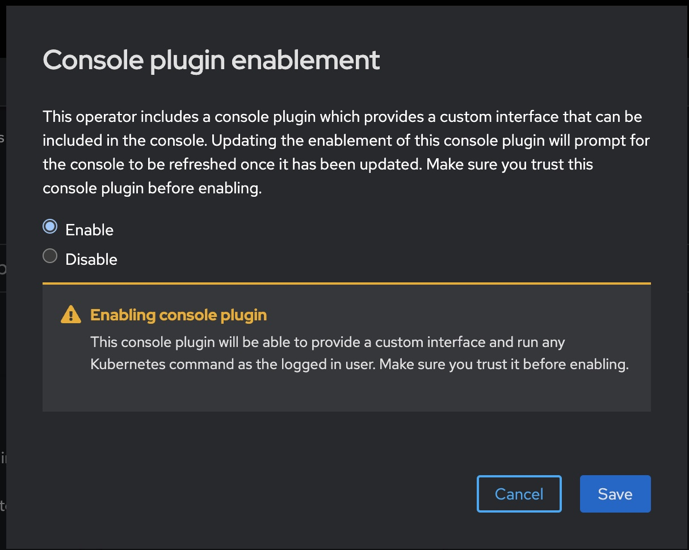
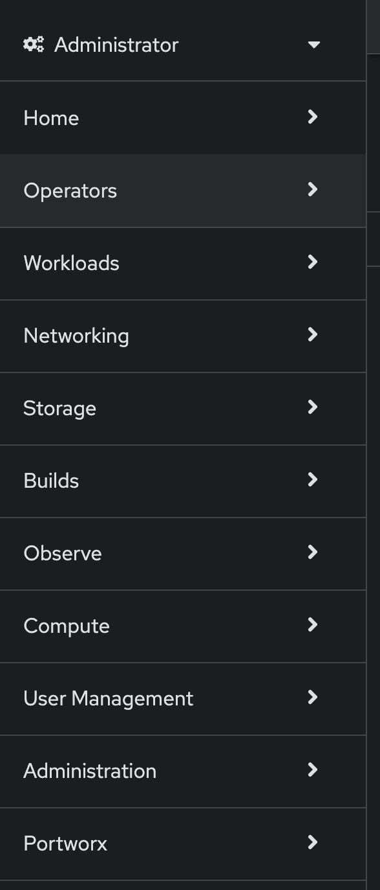
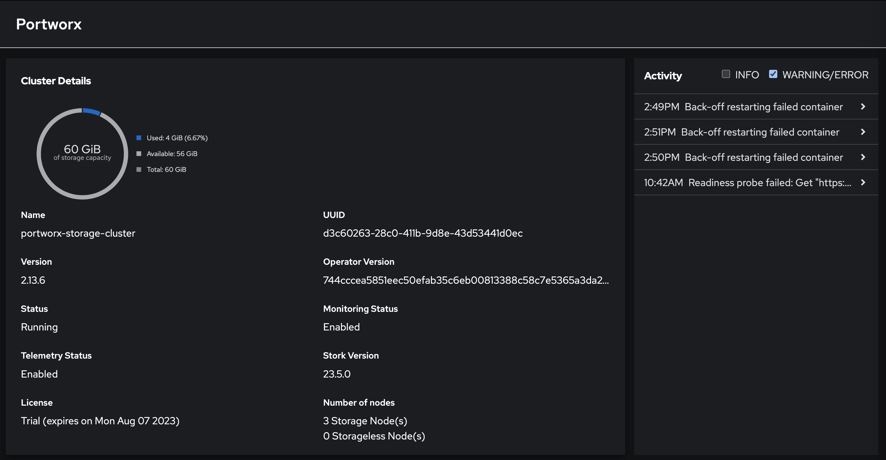

=========================================
Installing the OpenShift Dynamic console plugin from Portworx
=========================================

Enabling the OpenShift Dynamic console plugin
---------------------------------------------------

The OpenShift Dynamic console plugin from Portworx allows users to leverage the OpenShift Web console to monitor their storage resources. In this module, we will enable the Dynamic plugin using the Portworx Operator. 
Use the following steps to enable the dynamic plugin: 

1. Log into the OpenShift Web console using the admin credentials provided to you in the email. 
2. Once logged in, navigate to the `Operators` tab in the left navigation pane, and select `Installed Operators`. 
3. Select `Portworx Enterprise` from the list of installed operators. 

4. Click on the `Console plugin Disabled` option, and select `Enable` radio button and click `Save`. 

5. It takes a couple of minutes for the Portworx Operator to install the pods necessary for the additional UI tabs. Once the pods have been deployed, you should see a pop-up asking you to `Refresh web console`. 

  
6. Once you refresh the web console, you should see the new Portworx tab show up in the left navigation pane. 

Portworx Cluster Dashboard
---------------------------------------------------

Using the OpenShift Web console, navigate to the Portworx Cluster Dashboard. Using this dashboard, you can monitor the different component versions, events, volumes, drives, pools and storage nodes that are deployed on your OpenShift cluster. 

Portworx Storage Class Tab 
---------------------------------------------------

The Portworx Dynamic plugin allows users get more details about the different Portworx Storage Classes being deployed on the OpenShift cluster to enable dynamic volume provisioning. We will use this tab to get more details about the storage classes that deploy in the next module. 

Portworx Persistent Volume Claim Tab 
---------------------------------------------------

The Portworx Dynamic plugin allows users get more details about the different Portworx Persistent Volumes being used by the stateful applications running on your OpenShift cluster. We will use this tab to get more details about the volumes that we deploy throughout the workshop.
