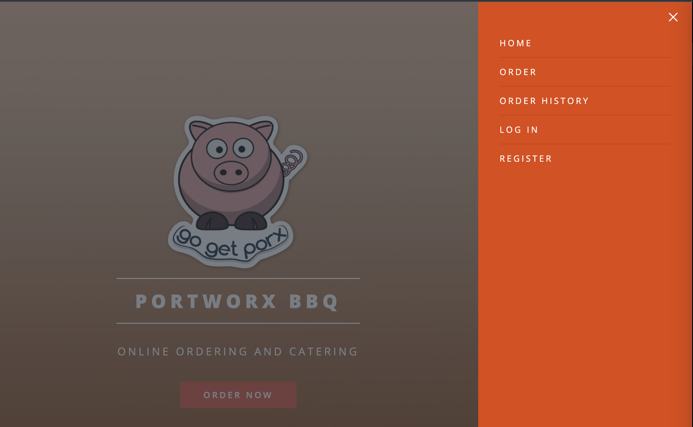
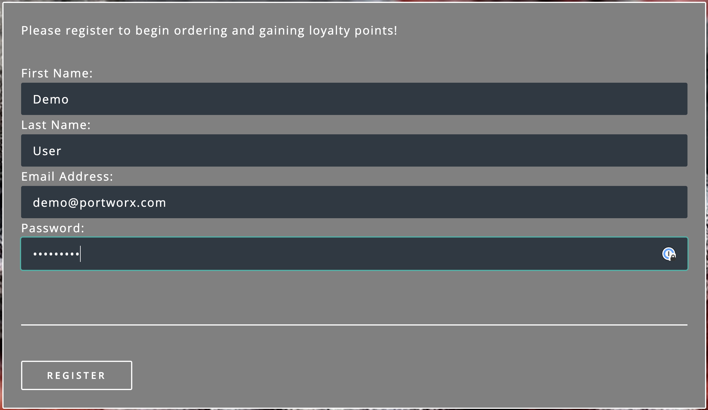
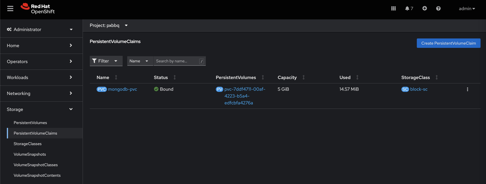
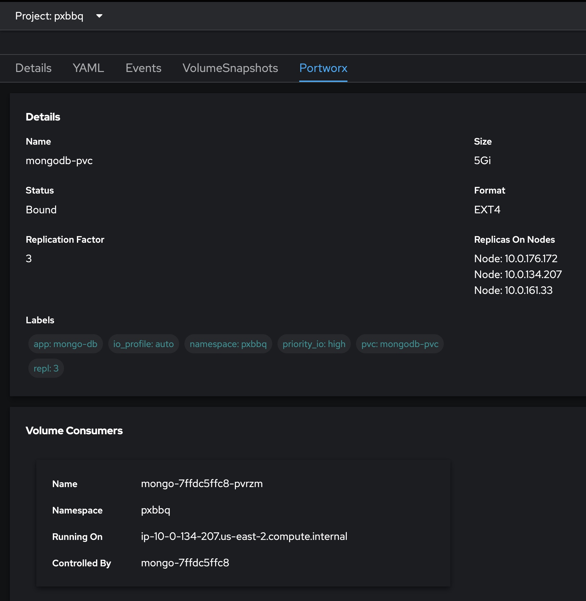
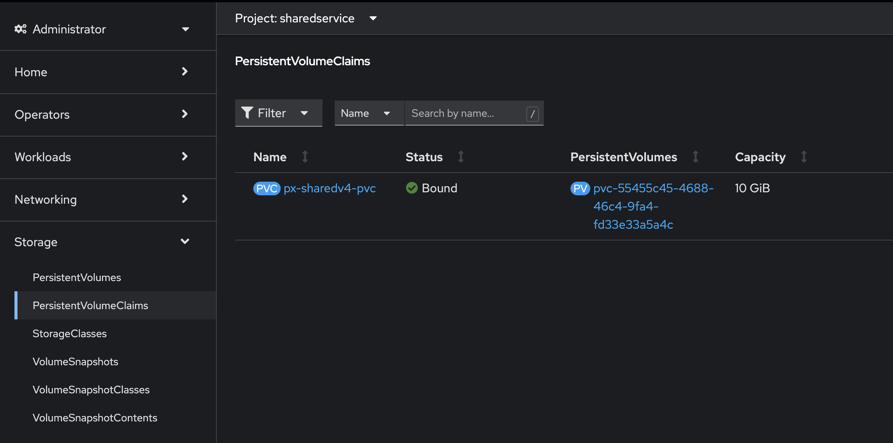
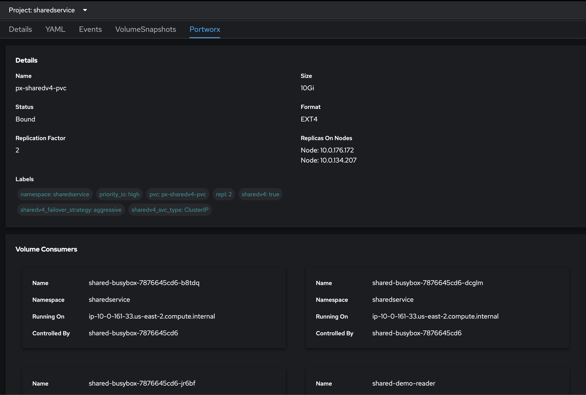

=======================================
StorageClasses, RWO, and RWX Volumes
=======================================
In this scenario, you'll learn about Portworx Enterprise StorageClass parameters and deploy demo applications that use RWO (ReadWriteOnce) and RWX (ReadWriteMany) Persistent Volumes provisioned by Portworx Enterprise.

Deploying Portworx Storage Classes
-----------------------
Portworx provides the ability for users to leverage a unified storage pool to dynamically provision both Block-based (ReadWriteOnce) and File-based (ReadWriteMany) volumes for applications running on your Kubernetes cluster without having to provision multiple CSI drivers/plugins, and without the need for specific backing storage devices!

Deploy StorageClass for Block (ReadWriteOnce) volumes
~~~~~~~~~~
Run the following command to create a new yaml file for the block-based StorageClass configuration:

.. code-block:: shell

  cat << EOF >> /tmp/block-sc.yaml
  kind: StorageClass
  apiVersion: storage.k8s.io/v1
  metadata:
    name: block-sc
  provisioner: pxd.portworx.com
  parameters:
    repl: "3"
    priority_io: "high"
    io_profile: "auto"
  allowVolumeExpansion: true
  EOF

PVCs provisioned using the above StorageClass will have a replication factor of 3, which means there will be three replicas of the PVC spread across the Kubernetes worker nodes.
Now, let's use the following command to apply this yaml file and deploy the StorageClass on our Kubernetes cluster:

.. code-block:: shell

  oc create -f /tmp/block-sc.yaml

Deploy StorageClass for File (ReadWriteMany) volumes
~~~~~~~~~~
Run the following command to create a new yaml file for the file-based StorageClass configuration:

.. code-block:: shell

  cat << EOF >> /tmp/file-sc.yaml
  kind: StorageClass
  apiVersion: storage.k8s.io/v1
  metadata:
    name: file-sc
  provisioner: pxd.portworx.com
  parameters:
    repl: "2"
    priority_io: "high"
    sharedv4: "true"
    sharedv4_svc_type: "ClusterIP"
    sharedv4_failover_strategy: "aggressive"
  EOF

PVCs provisioned using the above StorageClass can be accessed by multiple pods at the same time (ReadWriteMany) and will have a replication factor of 2.

Now, let's use the following command to apply this yaml file and deploy the StorageClass on our Kubernetes cluster:

.. code-block:: shell

  oc create -f /tmp/file-sc.yaml

Use the following command to look at all the storage classes deployed on your cluster. 

.. code-block:: shell

  oc get sc 

Deploying demo application for ReadWriteOnce volumes
-----------------------

In this step, we will deploy a demo application that provisions a MongoDB database that uses a ReadWriteOnce volume to store data.

Deploy StorageClass for Block (ReadWriteOnce) volumes
~~~~~~~~~~

.. code-block:: shell

  oc create ns pxbbq

Deploy the PostgreSQL database resources in the "demo" namespace
~~~~~~~~~~

.. code-block:: shell 

  cat << EOF >> /tmp/pxbbq-mongo.yaml
  ---
  apiVersion: "v1"
  kind: "PersistentVolumeClaim"
  metadata: 
    name: "mongodb-pvc"
    namespace: "pxbbq"
    labels: 
      app: "mongo-db"
  spec: 
    accessModes: 
      - ReadWriteOnce
    resources: 
      requests: 
        storage: 5Gi
    storageClassName: block-sc
  ---
  apiVersion: apps/v1
  kind: Deployment
  metadata:
    name: mongo
    labels:
      app.kubernetes.io/name: mongo
      app.kubernetes.io/component: backend
    namespace: pxbbq
  spec:
    selector:
      matchLabels:
        app.kubernetes.io/name: mongo
        app.kubernetes.io/component: backend
    replicas: 1
    template:
      metadata:
        labels:
          app.kubernetes.io/name: mongo
          app.kubernetes.io/component: backend
      spec:
        containers:
        - name: mongo
          image: mongo
          env:
            - name: MONGO_INITDB_ROOT_USERNAME
              value: porxie
            - name: MONGO_INITDB_ROOT_PASSWORD
              value: "porxie"
          args:
            - --bind_ip
            - 0.0.0.0
          resources:
            requests:
              cpu: 100m
              memory: 100Mi
          ports:
          - containerPort: 27017
          volumeMounts:
          - name: mongo-data-dir
            mountPath: /data/db
        volumes:
        - name: mongo-data-dir
          persistentVolumeClaim:
            claimName: mongodb-pvc
  ---
  apiVersion: v1
  kind: Service
  metadata:
    name: mongo
    labels:
      app.kubernetes.io/name: mongo
      app.kubernetes.io/component: backend
    namespace: pxbbq
  spec:
    ports:
    - port: 27017
      targetPort: 27017
    type: ClusterIP
    selector:
      app.kubernetes.io/name: mongo
      app.kubernetes.io/component: backend
  EOF

.. code-block:: shell

  oc create -f /tmp/pxbbq-mongo.yaml

Deploy the front-end components for the application in the `demo` namespace
~~~~~~~~~~

.. code-block:: shell

  cat << EOF >> /tmp/pxbbq-frontend.yaml
  ---
  apiVersion: apps/v1
  kind: Deployment                 
  metadata:
    name: pxbbq-web  
    namespace: pxbbq         
  spec:
    replicas: 3                    
    selector:
      matchLabels:
        app: pxbbq-web
    template:                      
      metadata:
        labels:                    
          app: pxbbq-web
      spec:                        
        containers:
        - name: pxbbq-web
          image: eshanks16/pxbbq:v3.2
          env:
          - name: MONGO_INIT_USER
            value: "porxie" #Mongo User with permissions to create additional databases and users. Typically "porxie" or "pds"
          - name: MONGO_INIT_PASS
            value: "porxie" #Required to connect the init user to the database. If using the mongodb yaml supplied, use "porxie"
          - name: MONGO_NODES
            value: "mongo" #COMMA SEPARATED LIST OF MONGO ENDPOINTS. Example: mongo1.dns.name,mongo2.dns.name
          - name: MONGO_PORT
            value: "27017"
          - name: MONGO_USER
            value: porxie #Mongo DB User that will be created by using the Init_User
          - name: MONGO_PASS
            value: "porxie" #Mongo DB Password for User that will be created by using the Init User
          imagePullPolicy: Always
          ports:
            - containerPort: 8080    
  ---
  apiVersion: v1
  kind: Service
  metadata:
    name: pxbbq-svc
    namespace: pxbbq
    labels:
      app: pxbbq-web
  spec:
    ports:
    - port: 80
      targetPort: 8080
    type: LoadBalancer
    selector:
      app: pxbbq-web
  EOF

.. code-block:: shell

  oc apply -f /tmp/pxbbq-frontend.yaml

Monitor the application deployment using the following command:
~~~~~~~~~~

.. code-block:: shell

  watch oc get all -n pxbbq

When all of the pods are running, press `CTRL+C` to exit.

Create some data using the app:
~~~~~~~~~~
Use the following commnad to fetch the LoadBalancer endpoint for the pxbbq-svc service in the demo namespace and navigate to it using a new browser tab. 

.. code-block:: shell

  oc get svc -n pxbbq pxbbq-svc

It will take a couple of minutes for the LoadBalancer endpoint to be online. 

Interact with the Demo application
~~~~~~~~~~

This demo application allows users to place orders that are saved in the backend MongoDB database. Use the following steps to register a new user and place a simple order. 

1. Click on **Menu** on the Top Right and select **Register**.

2. Enter your first name, last name, email address and password. Click Register. 

3. Click on **Menu** on the Top Right and select **Order**. 

4. Select a Main Dish, Couple of Side dishes and a drink. Click **Place Order**. 

5. You can either click on the order confirmation, or navigate to **Order History** from the Top Right, to find your order. 

.. image:: images/pxbbq-5.jpg
  :width: 600

Now that we have some data generated, let's proceed with the next section. 

Inspect the MongoDB volume
~~~~~~~~~~

We will inspect the MongoDB persistent volume using the Dynamic plugin that we installed in the previous module. 

1. Navigate to the OpenShift web console using the link and credentials you received in the email and login using the `admin` user. 
2. Go to Storage --> PersistentVolumeClaims --> and select the `pxbbq` project. 

3. Select the `mongodb-pvc` persistent volume claim, and select the `Portworx` tab. This will give you details about the persistent volume, like the Replication Factor, Size, Format, where the replicas are stored on the OpenShift cluster, and the pod that is consuming the persistent volume claim. 

In addition to the OpenShift Dynamic plugin, you can also use CLI commands to get the same details about the persistent volume. 

Use the following command to inspect the MongoDB volume and look at the Portworx parameters configured for the volume:

.. code-block:: shell

  VOL=`oc get pvc -n pxbbq | grep mongodb-pvc | awk '{print $3}'`
  PX_POD=$(oc get pods -l name=portworx -n portworx -o jsonpath='{.items[0].metadata.name}')
  oc exec -it $PX_POD -n portworx -- /opt/pwx/bin/pxctl volume inspect ${VOL}

Observe how Portworx creates volume replicas, and spreads them across your Kubernetes worker nodes.

In this step, you saw how Portworx can dynamically provisions a highly available ReadWriteOnce persistent volume for your application.

Deploying demo application for ReadWriteMany volumes
-----------------------
Portworx offers a `sharedv4 service` volume which allows applications to connect to the shared persistent volume either using a ClusterIP or a LoadBalancer endpoint. This is advantageous as even if one of the worker node goes down, the shared volume is still accessible without any interruption of the application utilizing the data on the shared volume.

Create the `sharedservice` namespace:
~~~~~~~~~~

.. code-block:: shell

  oc create ns sharedservice

Deploy the sharedv4 service PVC
~~~~~~~~~~
Review the yaml for the RWX PVC:

.. code-block:: shell

  cat << EOF >> /tmp/sharedpvc.yaml
  kind: PersistentVolumeClaim
  apiVersion: v1
  metadata:
    name: px-sharedv4-pvc
    annotations:
      volume.beta.kubernetes.io/storage-class: file-sc
  spec:
    accessModes:
      - ReadWriteMany
    resources:
      requests:
        storage: 10Gi
  EOF

Then apply the yaml to create the PVC:

.. code-block:: shell

  oc apply -f /tmp/sharedpvc.yaml -n sharedservice

Deploy the busybox pods
~~~~~~~~~~
Create a new yaml file to deploy the busybox pod yaml we'll be using:

.. code-block:: shell 

  cat << EOF >> /tmp/busyboxpod.yaml
  apiVersion: apps/v1
  kind: Deployment
  metadata:
    labels:
      app: shared-demo
    name: shared-busybox
  spec:
    replicas: 3
    selector:
      matchLabels:
        app: shared-demo
    template:
      metadata:
        labels:
          app: shared-demo
      spec:
        volumes:
        - name: shared-vol
          persistentVolumeClaim:
            claimName: px-sharedv4-pvc
        terminationGracePeriodSeconds: 5
        containers:
        - image: busybox
          imagePullPolicy: Always
          name: busybox
          volumeMounts:
          - name: shared-vol
            mountPath: "/mnt"
          command:
            - sh
          args:
            - -c
            - |
              while true; do
                echo -e "{\"time\":\$(date +%H:%M:%S),\"hostname\":\$(hostname) writing to shared vol }""\n" >> /mnt/shared.log
                sleep 1
              done
  ---
  apiVersion: v1
  kind: Pod
  metadata:
    name: shared-demo-reader
  spec:
    volumes:
    - name: shared-vol
      persistentVolumeClaim:
        claimName: px-sharedv4-pvc
    terminationGracePeriodSeconds: 5
    containers:
    - image: busybox
      imagePullPolicy: Always
      name: busybox
      volumeMounts:
      - name: shared-vol
        mountPath: "/mnt"
      command:
        - sh
      args:
        - -c
        - |
          while true; do
            tail -f /mnt/shared.log
          done
  EOF
  
Then apply the yaml to create the deployment and reader pod:

.. code-block:: shell 

  oc apply -f /tmp/busyboxpod.yaml -n sharedservice
 
This creates a deployment using multiple simple busybox pods that have mounted and will constantly write to the shared persistent volume. It also deploys a single busybox pod that will constantly read from the shared persistent volume.

Inspect the volume
~~~~~~~~~~
Let's take a look at what information Portworx gives us about our shared volume:

1. Navigate to the OpenShift Web console and log in as the `admin` user. 
2. Go to Storage --> PersistentVolumeClaims --> and select the `sharedservice` project. 

3. Select the `px-sharedv4-pvc` persistent volume claim, and select the `Portworx` tab. This will give you details about the persistent volume, like the Replication Factor, Size, Format, where the replicas are stored on the OpenShift cluster, and the pod that is consuming the persistent volume claim. 

 
Note that we have four pods accessing the RWX volume for our demo!

Go back to the CLI, and inspect the sharedv4service Endpoint:

.. code-block:: shell

  oc describe svc -n sharedservice

Applications can mount the RWX using the ClusterIP (IP) and Portworx will automatically redirect it to one of the worker nodes in your cluster. The Endpoint in the output is the current node, but in case of that node going down, Portworx will automatically route the traffic using a different node endpoint, without the user having to reboot/restart the application pods. 

Inspect the log file to ensure that there was no application interruption due to node failure
~~~~~~~~~~
Let's tail the logs of the reader pod which is reading the log file being written to by the other three pods:

.. code-block:: shell

  oc logs shared-demo-reader -n sharedservice -f

Press `CTRL-C` to exit the oc logs command.

You've just deployed applications with different needs on the same Kubernetes cluster without the need to install multiple CSI drivers/plugins, and it will function exactly the same way no matter what backing storage you provide for Portworx Enterprise to use!

Wrap up this module
-----------------------
Use the following commands to delete objects used for this specific scenario:

.. code-block:: shell 

  oc delete -f /tmp/busyboxpod.yaml -n sharedservice
  oc delete -f /tmp/sharedpvc.yaml -n sharedservice
  oc delete ns sharedservice
  oc wait --for=delete ns/sharedservice --timeout=60s
