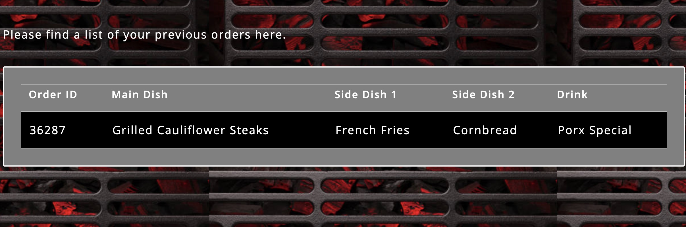
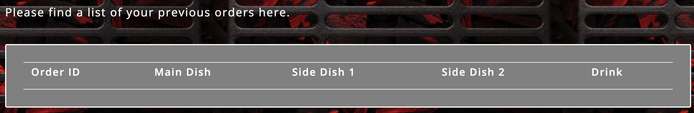

=========================
Protecting your data using VolumeSnapshots and GroupVolumeSnapshots
=========================

Portworx allows you to take standard snapshots of your persistent volumes on a per-volume basis, but also gives you the capability to take group snapshots if you have persistence across multiple volumes to enable application-consistent snapshots.

In this scenario, you will:

1. Perform a single volume snapshot and restore
2. Configure pre and post snapshot rules to quiesce an application
3. Perform a group volume snapshot and restore, utilizing the pre and post rules

Working with single volume snapshots
-------------------------
Before we take volume snapshots, let's navigate to the application UI that we deployed in the previous step, and verify that we can see order that we placed in the previous module.
To find the LoadBalancer endpoint for our demo application, use the following command: 

.. code-block:: shell

  oc get svc -n pxbbq pxbbq-svc

Navigate to the application and login as the Demo user and look at the `Order History`

  
Create volumesnapshot config
~~~~~~~~~~
Use the following yaml file to create a volume snapshot for your MongoDB PVC.

.. code-block:: shell 

  cat << EOF > /tmp/mongo-snapshot.yaml
  apiVersion: volumesnapshot.external-storage.k8s.io/v1
  kind: VolumeSnapshot
  metadata:
    name: px-mongo-snapshot
    namespace: pxbbq
  spec:
    persistentVolumeClaimName: mongodb-pvc
  EOF

Apply the yaml file to create the snapshot. 

.. code-block:: shell 

  oc apply -f /tmp/mongo-snapshot.yaml

And let's look at the snapshot object:

.. code-block:: shell

  oc get stork-volumesnapshots,volumesnapshotdatas -n pxbbq

Accidently "Drop Table" in your MongoDB database
~~~~~~~~~~
Let's delete the data within our MongoDB DB by exec'ing into the pod:

.. code-block:: shell

  POD=$(oc get pods -l app.kubernetes.io/name=mongo -n pxbbq | grep 1/1 | awk '{print $1}')
  oc exec -it $POD -n pxbbq -- mongosh --quiet  

And then drop our table:

.. code-block:: shell
  
  use admin
  db.auth('porxie','porxie')
  show dbs 
  use porxbbq
  db.dropDatabase()

Use the `quit` command to exit out of the mongodb pod. 

Verify data has been deleted 
~~~~~~~~~~
Navigate to the Portworx BBQ App using the LoadBalancer endpoint from the below command. You should not be able to login using the user you created in the last module. If you were already logged in, you should not see your order from order history. 

.. code-block:: shell

  oc get svc -n pxbbq pxbbq-svc

Restore our application from snapshot 
~~~~~~~~~~

Using the following yaml file, you can create a new PVC using the snapshot we created earlier: 

.. code-block:: shell

  cat << EOF > /tmp/pvc-from-snap.yaml
  apiVersion: v1
  kind: PersistentVolumeClaim
  metadata:
    name: px-mongo-snap-clone
    annotations:
      snapshot.alpha.kubernetes.io/snapshot: px-mongo-snapshot
  spec:
    accessModes:
       - ReadWriteOnce
    storageClassName: stork-snapshot-sc
    resources:
      requests:
        storage: 20Gi
  EOF

Create the PVC by applying the yaml 

.. code-block:: shell 

  oc apply -f /tmp/pvc-from-snap.yaml -n pxbbq 

Then inspect the new PVC: 

.. code-block:: shell

  oc get pvc px-mongo-snap-clone -n pxbbq

Redeploy the Demo Application
~~~~~~~~~~

Use the following commands to redeploy the application, so that it uses the new PVC object. First, we'll delete the old MongoDB instance:

.. code-block:: shell

  oc delete -f /tmp/pxbbq-mongo.yaml

Next, we can redeploy MongoDB using the new PVC that was restored from the snapshot:

.. code-block:: shell

  cat << EOF > /tmp/pxbbq-mongo-restore.yaml
  ---
  apiVersion: apps/v1
  kind: Deployment
  metadata:
    name: mongo
    labels:
      app.kubernetes.io/name: mongo
      app.kubernetes.io/component: backend
    namespace: pxbbq
  spec:
    selector:
      matchLabels:
        app.kubernetes.io/name: mongo
        app.kubernetes.io/component: backend
    replicas: 1
    template:
      metadata:
        labels:
          app.kubernetes.io/name: mongo
          app.kubernetes.io/component: backend
      spec:
        containers:
        - name: mongo
          image: mongo
          env:
            - name: MONGO_INITDB_ROOT_USERNAME
              value: porxie
            - name: MONGO_INITDB_ROOT_PASSWORD
              value: "porxie"
          args:
            - --bind_ip
            - 0.0.0.0
          resources:
            requests:
              cpu: 100m
              memory: 100Mi
          ports:
          - containerPort: 27017
          volumeMounts:
          - name: mongo-data-dir
            mountPath: /data/db
        volumes:
        - name: mongo-data-dir
          persistentVolumeClaim:
            claimName: px-mongo-snap-clone
  ---
  apiVersion: v1
  kind: Service
  metadata:
    name: mongo
    labels:
      app.kubernetes.io/name: mongo
      app.kubernetes.io/component: backend
    namespace: pxbbq
  spec:
    ports:
    - port: 27017
      targetPort: 27017
    type: ClusterIP
    selector:
      app.kubernetes.io/name: mongo
      app.kubernetes.io/component: backend  
  EOF

Apply the yaml file: 

.. code-block:: shell

  oc apply -f /tmp/pxbbq-mongo-restore.yaml

Verify the application has been completely restored
~~~~~~~~~~

Access the application by navigating to the LoadBalancer endpoint and refreshing the page. Our original order will be back in our order history.
If you need to find your LoadBalancer endpoint, use the following command: 

.. code-block:: shell
  
  oc get svc -n pxbbq pxbbq-svc

In this step, we took a snapshot of the persistent volume, deleted the database table and then restored our application by restoring the persistent volume using the snapshot!

Portworx Group Volume Snapshots
-------------------------
In this step, we will look at how you can use Portworx Group Volume Snapshots and 3D snapshots - to take application consistent multi-PVC snapshots for your application.

Create StorageClass for group volume snapshots
~~~~~~~~~~

Review the yaml of the StorageClass we are creating: 

.. code-block:: shell

  cat << EOF > /tmp/group-sc.yaml
  kind: StorageClass
  apiVersion: storage.k8s.io/v1
  metadata:
    name: group-sc
  provisioner: pxd.portworx.com
  parameters:
    repl: "2"
  EOF

Then apply the yaml to create it: 

.. code-block:: shell

  oc apply -f /tmp/group-sc.yaml

Create a new namespace for MySQL 
~~~~~~~~~~

.. code-block:: shell

  oc create ns mysql

Create a pre-snap and post-snap rules for MySQL
~~~~~~~~~~

Portworx allows users to specify pre- and post-snapshot rules to ensure that the snapshots are application consistent and not crash consistent.
For this example, we are creating a pre-snapshot and a post-snapshot rule for MySQL that we will use when we take a group volume snapshot.

Review the yaml for the snapshot rule:

.. code-block:: shell

  cat << EOF > /tmp/mysql-presnap-rule.yaml
  apiVersion: stork.libopenstorage.org/v1alpha1
  kind: Rule
  metadata:
    name: mysql-presnap-rule
  rules:
    - podSelector:
        app: mysql
      actions:
      - type: command
        value: mysql --user=root --password=password -Bse 'FLUSH TABLES WITH READ LOCK;system ${WAIT_CMD};'
  EOF

.. code-block:: shell

  cat << EOF > /tmp/mysql-postsnap-rule.yaml
  apiVersion: stork.libopenstorage.org/v1alpha1
  kind: Rule
  metadata:
    name: mysql-postsnap-rule
  rules:
    - podSelector:
        app: mysql
      actions:
      - type: command
        value: mysql --user=root --password=password -Bse 'FLUSH LOGS; UNLOCK TABLES;'
  EOF

Let's apply both the rules: 

.. code-block:: shell

  oc apply -f /tmp/mysql-presnap-rule.yaml -n mysql
  oc apply -f /tmp/mysql-postsnap-rule.yaml -n mysql

Deploy MySQL statefulset, service, and secret in the mysql namespace. 
~~~~~~~~~~

.. code-block:: shell

  cat << EOF > /tmp/mysql-app.yaml
  apiVersion: v1
  kind: Secret
  metadata:
    name: mysql-password
  type: opaque
  stringData:
    MYSQL_ROOT_PASSWORD: password
  ---
  apiVersion: v1
  kind: Service
  metadata:
    name: mysql
    labels:
      app: mysql
  spec:
    ports:
    - port: 3306
    clusterIP: None
    selector:
      app: mysql
  ---
  apiVersion: apps/v1
  kind: StatefulSet
  metadata:
    name: mysql-set
  spec:
    selector:
      matchLabels:
        app: mysql
    serviceName: "mysql"
    replicas: 3
    template:
      metadata:
        labels:
          app: mysql
      spec:
        terminationGracePeriodSeconds: 10
        containers:
        - name: mysql
          image: mysql:5.7
          ports:
          - containerPort: 3306
          volumeMounts:
          - name: mysql-store
            mountPath: /var/lib/mysql
          env:
            - name: MYSQL_ROOT_PASSWORD
              valueFrom:
                secretKeyRef:
                  name: mysql-password
                  key: MYSQL_ROOT_PASSWORD
    volumeClaimTemplates:
    - metadata:
        name: mysql-store
      spec:
        accessModes: ["ReadWriteOnce"]
        storageClassName: "group-sc"
        resources:
          requests:
            storage: 2Gi
  ---
  apiVersion: v1
  kind: Pod
  metadata:
    name: mysql-client
  spec:
    containers:
    - name: mysql-container
      image: alpine
      command: ['sh','-c', "sleep 1800m"]
      imagePullPolicy: IfNotPresent
  EOF

Apply the yaml file: 

.. code-block:: shell

  oc apply -f /tmp/mysql-app.yaml -n mysql

Watch until you see the three mysql pods, one mysql-client pod are up and running

.. code-block:: shell

  watch oc get pods,pvc,sts,svc,secret -n mysql

Note: use CTRL+C to exit out of the watch command once all the pods are running.

Interacting with MySQL
~~~~~~~~~~

Let's exec into the mysql-client pod and create a new `portworx` database and a new `features` table in that database. 

.. code-block:: shell

  oc exec mysql-client -n mysql -- apk add mysql-client

.. code-block:: shell

  oc exec mysql-client -n mysql -it -- sh
  mysql -u root -p --password=password -h mysql-set-0.mysql.mysql.svc.cluster.local
  create database portworx;
  show databases;
  
  use portworx;

  CREATE TABLE features (id varchar(255), name varchar(255), value varchar(255));
  INSERT INTO features (id, name, value) VALUES ('px-1', 'snapshots', 'point in time recovery!');
  INSERT INTO features (id, name, value) VALUES ('px-2', 'cloudsnaps', 'backup/restore to/from any cloud!');
  INSERT INTO features (id, name, value) VALUES ('px-3', 'STORK', 'convergence, scale, and high availability!');
  INSERT INTO features (id, name, value) VALUES ('px-4', 'share-volumes', 'better than NFS, run wordpress on k8s!');
  INSERT INTO features (id, name, value) VALUES ('px-5', 'DevOps', 'your data needs to be automated too!');

  SELECT * FROM features;

  quit   
  exit

Create and deploy a GroupVolumeSnapshot for MySQL
~~~~~~~~~~

.. code-block:: shell

  cat << EOF > /tmp/mysql-groupsnapshot.yaml
  apiVersion: stork.libopenstorage.org/v1alpha1
  kind: GroupVolumeSnapshot
  metadata:
    name: mysql-group-snapshot
  spec:
    preExecRule: mysql-presnap-rule
    postExecRule: mysql-postsnap-rule
    pvcSelector:
      matchLabels:
        app: mysql
  EOF

Apply the spec to execute the snapshot action:

.. code-block:: shell

  oc apply -f /tmp/mysql-groupsnapshot.yaml -n mysql

Note that once the snapshots have completed successfully, you should see Snapshot created successfully and it is ready for all mysql volumes in the oc describe output:

.. code-block:: shell

  oc get groupvolumesnapshot -n mysql
  oc describe groupvolumesnapshot mysql-group-snapshot -n mysql

Drop the Portworx database from MySQL
~~~~~~~~~~

Let's drop our Portworx database, and see if we can recover it from our group volume snapshots. 

.. code-block:: shell

  oc exec mysql-client -n mysql -it -- sh
  mysql -u root -p --password=password -h mysql-set-0.mysql.mysql.svc.cluster.local

  DROP database portworx;
  quit

  exit

Now, that we have dropped the Portworx database, let’s see how we can restore our data.

We will start by deleting the mysql statefulset, Creating new PVCs using the snapshots we created earlier, and then redeploying the mysql statefulset.

.. code-block:: shell

  oc delete sts mysql-set -n mysql

And let’s get the snapshot names and assign them into variables

.. code-block:: shell

  SNAP0=$(oc get volumesnapshotdatas.volumesnapshot.external-storage.k8s.io -n mysql | grep mysql-group-snapshot-mysql-store-mysql-set-0 | awk '{print $1}')
  SNAP1=$(oc get volumesnapshotdatas.volumesnapshot.external-storage.k8s.io -n mysql | grep mysql-group-snapshot-mysql-store-mysql-set-1 | awk '{print $1}')
  SNAP2=$(oc get volumesnapshotdatas.volumesnapshot.external-storage.k8s.io -n mysql | grep mysql-group-snapshot-mysql-store-mysql-set-2 | awk '{print $1}')

Now let’s create a new yaml file for our PVC objects that will be deployed from our snapshots:

.. code-block:: shell
  
  cat << EOF > /tmp/restoregrouppvc.yaml
  apiVersion: v1
  kind: PersistentVolumeClaim
  metadata:
    name: mysql-snap-store-mysql-set-0
    annotations:
      snapshot.alpha.kubernetes.io/snapshot: $SNAP0
  spec:
    accessModes:
       - ReadWriteOnce
    storageClassName: stork-snapshot-sc
    resources:
      requests:
        storage: 2Gi
  ---
  apiVersion: v1
  kind: PersistentVolumeClaim
  metadata:
    name: mysql-snap-store-mysql-set-1
    annotations:
      snapshot.alpha.kubernetes.io/snapshot: $SNAP1
  spec:
    accessModes:
       - ReadWriteOnce
    storageClassName: stork-snapshot-sc
    resources:
      requests:
        storage: 2Gi
  ---
  apiVersion: v1
  kind: PersistentVolumeClaim
  metadata:
    name: mysql-snap-store-mysql-set-2
    annotations:
      snapshot.alpha.kubernetes.io/snapshot: $SNAP2
  spec:
    accessModes:
       - ReadWriteOnce
    storageClassName: stork-snapshot-sc
    resources:
      requests:
        storage: 2Gi
  EOF

Now deploy the PVCs using the snapshots:

.. code-block:: shell

  oc apply -f /tmp/restoregrouppvc.yaml -n mysql

Inspect the PVCs deployed from the snapshots:

.. code-block:: shell

  oc get pvc -n mysql

Once you have these PVCs deployed, you can redeploy the MySQL statefulset.

.. code-block:: shell

  cat << EOF > /tmp/mysql-restore-app.yaml
  apiVersion: apps/v1
  kind: StatefulSet
  metadata:
    name: mysql-set
  spec:
    selector:
      matchLabels:
        app: mysql
    serviceName: "mysql"
    replicas: 3
    template:
      metadata:
        labels:
          app: mysql
      spec:
        terminationGracePeriodSeconds: 10
        containers:
        - name: mysql
          image: mysql:5.7
          ports:
          - containerPort: 3306
          volumeMounts:
          - name: mysql-snap-store
            mountPath: /var/lib/mysql
          env:
            - name: MYSQL_ROOT_PASSWORD
              valueFrom:
                secretKeyRef:
                  name: mysql-password
                  key: MYSQL_ROOT_PASSWORD
    volumeClaimTemplates:
    - metadata:
        name: mysql-snap-store
      spec:
        accessModes: ["ReadWriteOnce"]
        storageClassName: "group-sc"
        resources:
          requests:
            storage: 2Gi
  EOF

Apply the yaml file:

.. code-block:: shell

  oc apply -f /tmp/mysql-restore-app.yaml -n mysql

Inspect the Pods and PVCs deployed to restore our mysql instance:

.. code-block:: shell

  watch oc get pods,pvc -n mysql

Note: Use ctrl-c once all the pods are in running state.

Inspect the MySQL instance
~~~~~~~~~~

Let’s verify that all of our data was restored:

.. code-block:: shell

  oc exec mysql-client -n mysql -it -- sh
  mysql -u root -p --password=password -h mysql-set-0.mysql.mysql.svc.cluster.local
  use portworx;
  select * from features;

  quit 

  exit

As you can see, our data has been successfully restored and is consistent due to our pre-snapshot and post-snapshot commands executed prior and post the group volume snapshot!

That’s how easy it is to use Portworx snapshots, groupsnapshots and 3Dsnapshots to create application consistent snapshots for your applications running on Kubernetes.

Wrap up this module
-------------------------
Use the following commands to delete objects used for this specific scenario:

.. code-block:: shell

  kubectl delete -f /tmp/mysql-app.yaml -n mysql
  kubectl delete -f /tmp/restoregrouppvc.yaml -n mysql
  kubectl delete -f /tmp/mysql-groupsnapshot.yaml -n mysql
  kubectl delete -f /tmp/mysql-restore-app.yaml -n mysql
  kubectl delete -f /tmp/mongo-snapshot.yaml
  kubectl delete -f /tmp/pxbbq-mongo-restore.yaml -n pxbbq
  kubectl delete -f /tmp/pxbbq-frontend.yaml -n pxbbq
  kubectl delete ns pxbbq
  kubectl delete ns mysql
  kubectl wait --for=delete ns/pxbbq --timeout=60s
  kubectl wait --for=delete ns/mysql --timeout=60s
  

To learn more about `Portworx <https://portworx.com/>`__, below are some useful references. 

- `Deploy Portworx on Kubernetes <https://docs.portworx.com/scheduler/kubernetes/install.html>`__
- `Create Portworx volumes <https://docs.portworx.com/portworx-install-with-kubernetes/storage-operations/create-pvcs/>`__
- `Use cases <https://portworx.com/use-case/kubernetes-storage/>`__